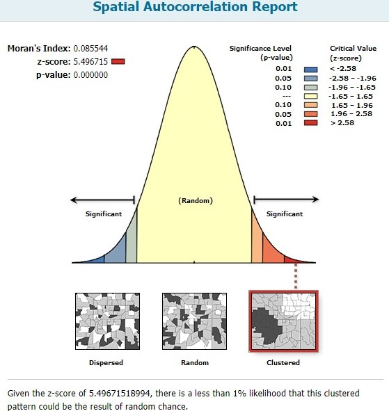
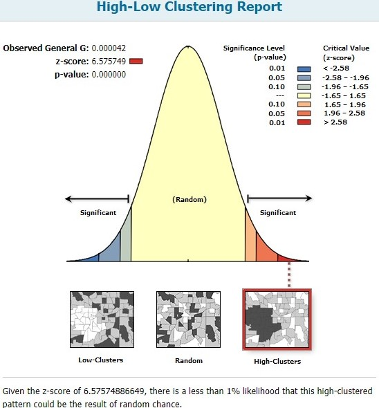

Assessment Part 1 Written evaluation (Word Count: 600)

This research selected 2015 sub-region data from Afghanistan, reported by the Department of Health Surveys (Spatial Data Repository, n.d.). With this data, the spotlight was shone on the potential spatial correlation between female literacy and household access to electricity, which is considered a measure of modernisation and development (Desai, 2012). QGIS and R were used to explore, visualize and compare the female literacy rates and household access to electricity, across sub-regions in Afghanistan. It is critical to remind readers that this study does not intend to prove causation but is solely intended to visualize a potential spatial correlation. 
This study began by using QGIS to read shapefiles downloaded from the Spatial Data Repository. However, there were many variables/fields with incomplete data. These fields include the maternal mortality rates and HIV-prevalence indicators. Missing values were indicated by '9999'. Since the fields of interest (female literacy: 'EDLITRWLIT', household electricity: 'HCELECHELC') were complete, no interpolations were required to fill in missing data. Following the data inspection, 2 identical maps were placed in the workspace to produce a choropleth map visualising two variables. To ensure that the map clearly portrays the correlation in question, the sub-regions with less than 50% of households with electricity were highlighted through rule-based graduated symbology. Bins of observations were created with the Jenks natural breaks classification. Transparencies and symbols were adjusted and the QGIS map was generated, with appropriate map elements. Finally, the map was embedded into Rmarkdown (Dennett, 2018a).
The initial R attempt to produce the map utilised the 'tmap' R-package. However, the end-product was considered to be unsatisfactory on aesthetic and intuitive levels. Making fine adjustments required an in-depth knowledge of the extensive R-package documentation. After consulting with peers and an appreciation of the 'leaflet' package through Dennett (2018b), a second attempt was made to maximise the potential of the 'leaflet' package. Bins of observations were determined by calculating quantiles instead of jenks, and other map elements were added to produce a more comprehensive and intuitive map. This created an interactive map with pop-up labels and multiple overlays by using the 'addLayersControl' function ('Leaflet for R - Show/Hide Layers', n.d.). This allows the user to select the variable to be visualised, to zoom-in, and to choose the type of basemap (ESRI gray canvas / topographic map). 
With the maps complete, it is crucial to evaluate the limitations and uncertainty of the data used. Although we do not have the data collection methodology, we can speculate that one probable limitation is the geo-political situation within Afghanistan which could lead to the under-reporting of female literacy rates, as well as compromise the accuracy because of security risks in data collection. These uncertainties should be considered in further analysis.
The process of using two different approaches to produce a map researching the same question has brought a keener understanding of the benefits and drawbacks of each approach. The ever-necessary process of cleaning, processing and analysing data is significantly easier with R-packages. However, minute adjustments in producing a map are easier in QGIS because of the intuitive and friendly user-interface, which ensures a smooth navigation and provides immediate updates with each change. For R, the smallest of changes require the cartographer to be aware of the intricate R documentation for each function within each package, before needing to run chunks of code again. This can be a time-consuming endeavour, albeit becoming more intuitive with experience and practice. Overall, there are advantages and disadvantages with each platform, but these serve to emphasise their complementarity. The choice of program should depend on the structure of the data, the cartographer's task, experience and preference. 

```{r Embedding Map generated by QGIS}
library(knitr)
knitr::include_graphics('afghan_latest.jpg')
```

```{r R-generation of Map, include=FALSE}
library(plotly)
library(maptools)
library(RColorBrewer)
library(classInt)
library(OpenStreetMap)
library(rJava)
library(sp)
library(rgeos)
library(tmap)
library(tmaptools)
library(sf)
library(rgdal)
library(geojsonio)
library(ggplot2)
library(shiny)
library(shinyjs)
library(dplyr)
library(tidyverse)
library(maps)
library(leaflet)
library(sf)
library(sp)
library(magrittr)

##### Reading shapefile used in QGIS into R ####
afghanmap <- read_shape("sdr_subnational_data_dhs_2015.shp", as.sf = TRUE)
afghan_lowelec <- afghanmap %>% filter(HCELECHELC<50)

# Making maps
afghan_osm <- read_osm(afghanmap, type = "esri", zoom = NULL)
```

```{r Generation of map with TMAP, eval=FALSE, include=FALSE}
##### Plotting with TMAP -- I did not find the map produced with this package very aesthetic and intuitive. Thus, I tried Leaflet in the next section instead.  #####
tmap_mode("plot")
tm_shape(afghanmap) +
  tm_polygons("EDLITRWLIT",
             style = "jenks",
             palette = "YlOrBr",
             midpoint = NA,
             border.col = "black",
             border.lwd = 0.5,
             title = "Female literacy (%)") +
  tm_text("DHSREGEN", size = 0.4, col = "black") +
tm_shape(afghan_lowelec) +
  tm_fill("HCELECHELC", alpha = 1, title = "Households with electricity") +
  tm_borders(col="black",lwd=2.0) +
  tm_text("DHSREGEN", size = 0.4, col = "black")
```

For an idea of how Part 1 looked with the Leaflet map, refer to http://rpubs.com/ucfnaws/435765.

```{r Generation of map with Leaflet, echo=FALSE}
##### Plotting with LEAFLET #####
library(leaflet)
afghanmapSP <- afghanmap %>%
  st_transform(crs = 4326) %>%
  as("Spatial")
afghan_lowelecSP <- afghan_lowelec %>%
  st_transform(crs = 4326) %>%
  as("Spatial")

breaks<-classIntervals(afghanmap$EDLITRWLIT, n=5, style="quantile")
breaks <- breaks$brks

breaks1 <- classIntervals(afghan_lowelec$HCELECHELC, n=5, style="quantile")
breaks1 <- breaks1$brks

pal <- colorBin(palette = "OrRd", 
                domain = afghanmapSP$EDLITRWLIT,
                bins = breaks,
                reverse = TRUE)

pal1 <- colorBin(palette = "Greys",
                 domain = afghan_lowelecSP$HCELECHELC,
                 bins = breaks1,
                 reverse = TRUE)

leaflet() %>%
  addPolygons(data = afghanmapSP, 
              stroke = FALSE,
              fillOpacity = 0.8,
              smoothFactor = 0.5,
              fillColor = ~pal(EDLITRWLIT),
              popup = ~DHSREGEN,
              group = "Female Literacy rates"
  ) %>%
  addLegend(data = afghanmapSP,
            "bottomright",
            pal = pal,
            values = ~EDLITRWLIT,
            title = "Female Literacy rates (%)",
            opacity = 1,
            group = "Female Literacy rates") %>%
  addProviderTiles("Esri.WorldGrayCanvas", group = "Light basemap") %>%
  addProviderTiles("Esri.WorldTopoMap", group = "Topo basemap") %>%
  addPolygons(data = afghan_lowelecSP,
              stroke = TRUE,
              color = "black",
              weight = 3,
              fillOpacity = 1,
              smoothFactor = 0.5,
              fillColor = ~pal1(HCELECHELC),
              popup = ~DHSREGEN,
              group = "Sub-regions with <50% Households with electricity"
  ) %>%
  addLegend(data = afghan_lowelecSP,
            "topright",
            pal = pal1,
            values = ~HCELECHELC,
            title = "Sub-regions with <50% Households with electricity",
            opacity = 1,
            group = "Sub-regions with <50% Households with electricity") %>%
  addLayersControl(
    baseGroups = c("Light basemap", "Topo basemap"),
    overlayGroups = c("Female Literacy rates","Sub-regions with <50% Households with electricity"),
    options = layersControlOptions(collapsed = FALSE)
  )
```

Assessment Part 2 -- Spatial Analysis Methodologies, based on 2016 Team 7 Route

```{r loading libraries, include=FALSE}
library(tmap)
library(geojsonio)
library(magrittr)
library(dplyr)
library(RColorBrewer)
library(rgdal)
library(tidyverse)
library(ggplot2)
library(ggmap)
library(OpenStreetMap)
library(sf)
library(sp)
library(leaflet)
library(geojson)
library(RCurl)
library(RJSONIO)
library(plyr)
library(spatstat)
library(MASS)
library(maptools)
library(GISTools)
library(rgeos)
library(tmaptools)
library(raster)
library(fpc)
library(mapview)
```

Answers to Problem Set Questions

Q1: Distance travelled by Team 7  =  46.604 km.

Q2: Team 7's route was with the 100m buffer of 24 TfL stations.

Q3: Team 7's total score achieved was 117 points, based on the 2016 scoring sheet. 

Q4: Team 7 passed through 30 out of 625 wards. Of these 30 wards, the lowest male life expectancy was 75.05, while the highest male life expectancy was 84.31.

Q5: The average male life expectancy was 78.77, while the average female life expectancy was 84.09. 

Q6: The CASA treasure hunt locations were not randomly or uniformly distributed. Instead, they were highly clustered, and concentrated. 

Based on the High/Low Clustering Getis-Ord General G test implemented on ArcMap, the z-score was 6.576. Based on Moran's-I Spatial Autocorrelation test implemented on ArcMap, the z-score was 5.497. 

These large z-scores and small p-values lead us to reject the hypothesis that the treasure hunt locations were truly random, at all conventional significance levels. There is less than 1% probability that the concentrated pattern is truly random. 


```{r Embedding Spatial autocorrelation results}
library(knitr)


```

Critical commentary (Word Count: 600 Words)

```{r Preparing Data for coursework, include=FALSE}
# 2016 Team 7 Route
hunt <- geojson_read("https://www.dropbox.com/s/wa2ip35tcmt93g3/Team7.geojson?raw=1",
                     method = "web",what = "sp")

tmap_mode("view")
tm_shape(hunt) +
 tm_lines(col = "green", lwd = 4)

huntSF <- st_as_sf(hunt)

huntaddresses <- read_csv("https://www.dropbox.com/s/v66l4cx7aia9jlo/huntLocations.csv?raw=1")

# code here lifted directly from - https://gist.github.com/josecarlosgonz/6417633
# highlight this whole block and create this function to access the Google Places API
url <- function(address, return.call = "json", sensor = "false") {
 root <- "https://maps.google.com/maps/api/geocode/"
 u <- paste(root, return.call, "?address=", address, "&sensor=", sensor, sep = "")
return(URLencode(u))
} 

# highlight this whole block and create this function to geocode some places just from a random # list of treasure hunt locations
geoCode <- function(address,verbose=FALSE) {
if(verbose) cat(address,"\n")
 u <- url(address)
 doc <- getURL(u)
 x <- fromJSON(doc,simplify = FALSE)
if(x$status=="OK") {
 lat <- x$results[[1]]$geometry$location$lat
 lng <- x$results[[1]]$geometry$location$lng
 location_type <- x$results[[1]]$geometry$location_type
 formatted_address <- x$results[[1]]$formatted_address
return(c(lat, lng, location_type, formatted_address))
 Sys.sleep(0.5)
 } else {
return(c(NA,NA,NA, NA))
 }
}
# now use the geoCode() function (which calls the URL function) to geocode our list of places

# for loop to cycle through every treasure hunt location
i=1
for(i in 1:nrow(huntaddresses)){
# Every nine records, pause 3 seconds so that the API doesn't kick us off...
if(i %% 5 == 0) Sys.sleep(3)
# now create a temporary list of useful elements
 tempdf <- as.list(geoCode(huntaddresses[i,1]))
# and write these back into our dataframe
 huntaddresses[i,3] <- tempdf[1]
 huntaddresses[i,4] <- tempdf[2]
 huntaddresses[i,5] <- tempdf[4]
}
# rename the columns
names(huntaddresses) <- c("Location","Points","lat","lon","GoogleAddress")
head(huntaddresses)

# unable to get the API key to work, use dropbox link instead. 
huntaddresses <- read.csv("https://www.dropbox.com/s/2cbu2ux9ddy9c0l/huntaddresses.csv?raw=1")
head(huntaddresses)
write.csv(huntaddresses, "huntaddresses.csv")
# Preparing London wards from data merged in previous weeks of the Course. 
LondonWards <- readOGR("C:/Users/awws9/OneDrive/Documents/UCL MSc SCUA/MT/GIS/Coursework2/ldn_ward_data.shp")

# Converting data to sf and similar BNG coordinate systems

BNG = "+init=epsg:27700"
WGS = "+init=epsg:4326"

LondonWardsBNG <- spTransform(LondonWards, BNG)

huntBNG <- spTransform(hunt, BNG)
tmap_mode("view")
tm_shape(huntBNG) +
 tm_lines(col = "green", lwd = 4)

crs(LondonWardsBNG)
crs(huntBNG)

LondonWardsSF <- st_as_sf(LondonWardsBNG) %>% st_set_crs(BNG)

huntBNG_SF <- st_as_sf(huntBNG) %>% st_set_crs(BNG)
tmap_mode("view")
tm_shape(huntBNG_SF) +
 tm_lines(col = "green", lwd = 4)

huntaddresses_df <- as.data.frame(huntaddresses)
xy <- huntaddresses_df[,c(4,3)]
huntaddresses_sp <- SpatialPointsDataFrame(coords = xy, data = huntaddresses_df)
huntaddresses_sf <- st_as_sf(huntaddresses_sp, coords = c("lon","lat")) %>% st_set_crs(BNG)
plot(huntaddresses_sf)
```


```{r Part 1 Questions, eval=FALSE, include=FALSE}

route_dist <- st_length(huntBNG_SF)
print(route_dist)

# Total distance travelled by Team 7 = 46.604km
```

```{r Q2: How many TFL stations did the route pass within 100m of?, eval=FALSE, include=FALSE}
# Creating 100m buffers around tube stations

tubestations <- readOGR("https://www.doogal.co.uk/LondonStationsKML.ashx", "London stations with zone information")
tubestations <- as.data.frame(tubestations)

write.csv(tubestations, "tflstations.csv")

xy2 <- tubestations[,c(3,4)]
tubestations_sp <- SpatialPointsDataFrame(coords = xy2, data = tubestations, proj4string = CRS("+init=epsg:27700"))
tubestations_sf <- st_as_sf(tubestations, coords = c("coords.x1","coords.x2"), crs = BNG)
plot(tubestations_sf)
tube_buffer <- st_buffer(tubestations_sf,dist = 100) %>% st_set_crs(BNG)
route_intersect <- st_intersects(tube_buffer,huntBNG_SF)
summary(route_intersect)
plot(huntBNG_SF)

st_write(huntBNG_SF,"hunt_route.shp")

# Route was within the 100m buffer of 24 tfl stations. 

```

```{r Q3: How many points scored? Count if route pass within 300m of Treasure hunt location, eval=FALSE, include=FALSE}
treasure_buffer <- st_buffer(huntaddresses_sf,300) %>% st_set_crs(BNG)
route_intersect2 <- st_intersects(treasure_buffer,huntBNG_SF)
print(route_intersect2)

# Using Arcgis, total score = 117. Using intersect feature, followed by summing up score. 

```

```{r Q4: Which wards did the route pass through? Which had the lowest and highest male life expectancy?, eval=FALSE, include=FALSE}

route_intersect3 <- st_intersects(LondonWardsSF,huntBNG_SF)

# Switched over to ArcMap for this
# It passed through 30 out of the 625 wards.
# Lowest male life expectancy : 75.05
# Highest male life expectancy: 84.31

```

```{r Q5: Average life expectancy of all the wards along the route, eval=FALSE, include=FALSE}
# Also on ArcGis 
# Average male life expectancy : 78.77
# Average female life expectancy: 84.09
```

```{r Q6: Any spatial patterns for CASA treasure hunt locations?, eval=FALSE, include=FALSE}
ldnward <- LondonWardsSF[,(76:78)]
ward_window <- as.owin(ldnward$geometry)
huntaddresses_sf <- st_set_crs(huntaddresses_sf, BNG)
treasure.ppp <- ppp(x=huntaddresses_sf$lon,y=huntaddresses_sf$lon,window = ward_window)


```

